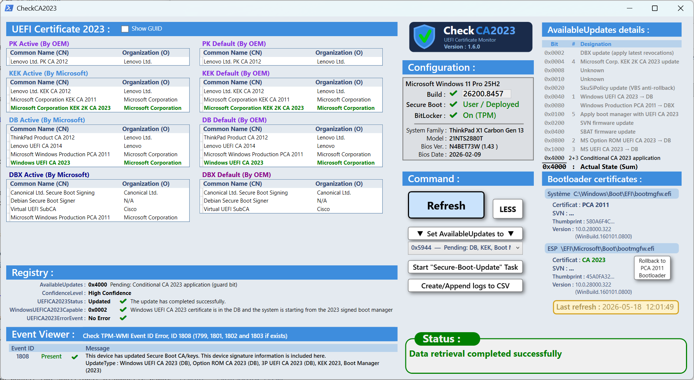
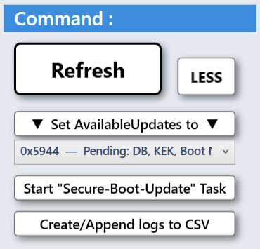
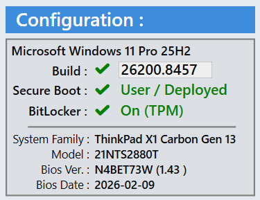

# CheckCA2023

> A PowerShell utility with a XAML GUI to monitor and validate the Microsoft CA 2023 Secure Boot certificate update process on Windows devices.


---

## Table of Contents

- [Overview](#overview)
- [Background](#background)
- [Prerequisites](#prerequisites)
- [Installation](#installation)
- [Usage](#usage)
- ["One More Thing"](#one-more-thing)
- [What It Checks](#what-it-checks)
- [Registry Reference](#registry-reference)
- [Update Process Summary](#update-process-summary)
- [Troubleshooting](#troubleshooting)
- [References](#references)
- [License](#license)

---

## Overview

**CheckCA2023** is a PowerShell script with a graphical user interface (XAML/WPF) that reads and displays all relevant data needed during the deployment of the new Microsoft CA 2023 Secure Boot certificates.

Instead of manually querying the registry, WMI, BIOS, and Event Viewer, CheckCA2023 consolidates all the information into a single, readable dashboard : making it easier for IT professionals to monitor the update status across their devices.

Click **MORE** to reveal additional diagnostic panels, including a bit-level breakdown of the `AvailableUpdates` registry value and bootloader certificate details for `bootmgfw.efi`.

> ⚠️ **Scope of this tool**
> CheckCA2023 monitors the **Registry Key deployment method**, one of several methods documented by Microsoft for deploying the CA 2023 Secure Boot certificate updates. Other deployment methods (Group Policy Objects, Microsoft Intune, WinCS APIs) are not covered by this tool.
> For the full list of available deployment methods, refer to: [Secure Boot Certificate Updates : Guidance for IT Professionals](https://support.microsoft.com/en-us/topic/secure-boot-certificate-updates-guidance-for-it-professionals-and-organizations-e2b43f9f-b424-42df-bc6a-8476db65ab2f)

> ✅ Successfully tested on ‎ ‎ ‎  ‎ ‎ ‎  



---

## Background

Microsoft is updating Secure Boot certificates as part of a major infrastructure refresh. The new **Windows UEFI CA 2023** and **Microsoft UEFI CA 2023** certificates replace the older ones to maintain the integrity of the Secure Boot chain of trust.

This update involves changes to:
- The Secure Boot **KEK** (Key Exchange Key)
- The Secure Boot **DB** (Allowed Signatures Database)
- The Secure Boot **DBX** (Forbidden Signatures Database)
- The boot manager signing chain

Failure to apply these updates before the old certificates expire may result in devices being unable to boot. IT administrators need clear visibility into where each device stands in this process.

> 📌 **Important:** Certificate update support requires a minimum build released on or after **October 14, 2025** (KB5066835 for Windows 11 24H2/23H2).

---

## Prerequisites

### Minimum OS Build

Your system must be running a build released on or after **October 14, 2025**.

- **Windows 10 22H2** and newer (including 21H2 LTSC)
- **Windows 11** : all supported versions
- **Windows Server 2022** and later

> Verify your build at: [KB5066835 - October 14, 2025](https://support.microsoft.com/en-us/topic/october-14-2025-kb5066835-os-builds-26200-6899-and-26100-6899-1db237d8-9f3b-4218-9515-3e0a32729685)
> Select your OS on the left and verify your installed build is equal to or higher than the October 2025 release.

### Secure Boot

Secure Boot must be **enabled** in the BIOS/UEFI firmware of the device.

### PowerShell

- **PowerShell 5.1** minimum (included with Windows 10/11)
- Must be run with **Administrator privileges**
- No external module required : CheckCA2023 reads UEFI certificate databases natively

---

## Installation

1. Clone or download this repository:

```powershell
git clone https://github.com/claude-boucher/CheckCA2023.git
```

2. Navigate to the project folder:

```powershell
cd CheckCA2023
```

3. Run the script:

```powershell
.\CheckCA2023.ps1
```

> ⚠️ **Run as Administrator** : reading UEFI variables and registry keys requires elevated privileges.

---

## Usage

Launch the script as Administrator. The GUI will open and automatically read the current state of your system.

Use the **Check / Refresh** button to update the displayed values at any time : especially useful while the Secure Boot update scheduled task is running in the background.

The interface provides three action buttons to assist with the deployment process:



| Button | Action |
|---|---|
| **▼ Set AvailableUpdates to ▼** | Selects a target value from the dropdown list and writes it to the `AvailableUpdates` registry key. All known update stages are available for selection, allowing administrators to target a specific step in the deployment sequence. |
| **Start "Secure-Boot-Update" Task** | Triggers the `\Microsoft\Windows\PI\Secure-Boot-Update` scheduled task immediately |
| **Create/Append logs to CSV** | Saves a snapshot of the current registry values and Event Viewer entries to `Log_CheckCA2023.csv` |

> ⚠️ **Administrator privileges are required** to use these action buttons.

The **Configuration** panel now also displays the **BitLocker** protection status of the system drive, including the active key protector type (TPM, TPM+PIN, Password), giving administrators immediate visibility into the encryption state before triggering any Secure Boot update.



The **Configuration** panel also displays the **Secure Boot operating mode** (User / Deployed / Setup / Audit) read from standard UEFI variables, with no OEM WMI dependency. This makes it easy to immediately spot machines stuck in **Setup Mode**, which cannot complete the CA 2023 deployment and would otherwise require time spent diagnosing downstream symptoms.

## "One More Thing..."

Click the **MORE** button to expand the interface and reveal two additional diagnostic panels.


- **Show GUID** view *(since v1.4.0)*: reveals `SignatureOwner` GUIDs in the 
  Secure Boot variables panel, with color coding to distinguish Microsoft-owned 
  (blue) vs OEM-owned (BlueViolet) certificates. Critical for diagnosing 
  misattributed CA 2023 entries in `db` causing BitLocker recovery issues.
  
- **Rollback to PCA 2011 Bootloader** *(since v1.5.0, diagnostic)*: restores 
  the original PCA 2011 ESP bootloader for test rollback scenarios on 
  downgraded BIOS. Enabled only when System=PCA 2011 and ESP=CA 2023. 
  Operator is responsible for prerequisites (BitLocker suspension, db 
  contents, SBAT compatibility).

### AvailableUpdates details

A bit-level breakdown of the `AvailableUpdates` registry value, displaying all 13 individual bit flags with their hex value, sequence order, and designation.

Each row includes a detailed tooltip explaining the exact operation performed by that bit. Rows are color-coded dynamically:

| Color | Meaning |
|---|---|
| **Gray** | Bit inactive : operation not scheduled |
| **Black** | Bit active : operation scheduled or pending |
| **Green** | Bit was active at previous refresh and is now cleared : operation completed |

### Bootloader certificates

Displays the signing certificate, thumbprint, and file version of `bootmgfw.efi` from two locations:

| Location | Path |
|---|---|
| **System volume** | `C:\Windows\Boot\EFI\bootmgfw.efi` |
| **EFI System Partition** | `\EFI\Microsoft\Boot\bootmgfw.efi` |

The certificate authority is color-coded: **green** for CA 2023, default color for PCA 2011. The full thumbprint is available via tooltip.

> 💡 In a healthy post-migration state, the ESP bootloader should be signed with **CA 2023** while the system volume may still show **PCA 2011** : this is expected behavior.

### Last refresh

Displays the date and time of the last data refresh : useful when sharing screenshots for remote diagnostics.

---

## What It Checks

CheckCA2023 consolidates data from multiple system sources:

| Source | Data |
|---|---|
| **WMI** | System information, BIOS details |
| **BIOS / UEFI Firmware** | Secure Boot state and operating mode (User / Deployed / Setup / Audit), firmware version |
| **BitLocker** | Protection status and active key protector type |
| **Secure Boot PK / PKDefault** | Platform Key : active and factory default |
| **Secure Boot KEK / KEKDefault** | Key Exchange Keys : active and factory default |
| **Secure Boot DB / DBDefault** | Allowed Signatures : active and factory default |
| **Secure Boot DBX / DBXDefault** | Forbidden Signatures : active and factory default (X.509 certificates only) |
| **Registry** | Update progress (`AvailableUpdates`), status (`UEFICA2023Status`), capability (`WindowsUEFICA2023Capable`), confidence level (`ConfidenceLevel`) |
| **Bootloader** | Signing certificate, thumbprint and file version of `bootmgfw.efi` on both system volume and EFI System Partition |
| **Event Viewer** | Secure Boot DB and DBX variable update events (TPM-WMI source) |
| **CSV Log** | Snapshot export of registry values and Event Viewer entries at any point in time |

> 💡 **Tips**
> - Hover over any **Common Name (CN)** in a certificate grid to display the issuer, country, state and validity period of that certificate.
> - Hover over the **ConfidenceLevel** value to display its full description.
> - Hover over any **Thumbprint** in the Bootloader certificates panel to display the full hash value.

---

## Registry Reference

### `HKLM\SYSTEM\CurrentControlSet\Control\SecureBoot`

#### `AvailableUpdates` (REG_DWORD)

This value controls which Secure Boot update operations are scheduled. It is a bitmask : each bit represents a specific operation.

**Known progression sequence:**

| Value | Meaning |
|---|---|
| `0x5944` | All relevant updates scheduled : starting point for IT-managed deployment |
| `0x5904` | Windows UEFI CA 2023 applied to DB |
| `0x5104` | Microsoft Option ROM UEFI CA 2023 applied to DB |
| `0x4104` | Microsoft UEFI CA 2023 applied to DB |
| `0x4100` | CA 2023-signed boot manager applied |
| `0x4000` | Conditional guard bit only : all operations complete, pending final reboot |
| `0x0000` | No updates scheduled : process complete |

**Individual bit flags:**

| Bit | Designation | Description |
|---|---|---|
| `0x0002` | DBX revocation update | Applies the latest DBX revocations |
| `0x0004` | KEK 2K CA 2023 → KEK | Adds Microsoft Corporation KEK 2K CA 2023 to the KEK store |
| `0x0020` | SkuSiPolicy update | Applies Microsoft-signed VBS anti-rollback revocation policy |
| `0x0040` | Windows UEFI CA 2023 → DB | Adds the Windows UEFI CA 2023 certificate to the DB |
| `0x0080` | Windows Production PCA 2011 → DBX | Adds Windows Production PCA 2011 to DBX, revoking the older boot manager signing chain |
| `0x0100` | Boot manager update | Applies the CA 2023-signed boot manager to the EFI System Partition |
| `0x0200` | SVN firmware update | Applies a Secure Version Number update to the firmware |
| `0x0400` | SBAT firmware update | Applies a Secure Boot Advanced Targeting update to the firmware |
| `0x0800` | Option ROM UEFI CA 2023 → DB | Adds Microsoft Option ROM UEFI CA 2023 to DB (conditional on 0x4000) |
| `0x1000` | Microsoft UEFI CA 2023 → DB | Adds Microsoft UEFI CA 2023 to DB (conditional on 0x4000) |
| `0x4000` | Conditional CA 2023 guard bit | Modifies bits 0x0800 and 0x1000: CA 2023 certificates are only added if Microsoft Corporation UEFI CA 2011 is already present in the DB |

---

### `HKLM\SYSTEM\CurrentControlSet\Control\SecureBoot\Servicing`

#### `UEFICA2023Status` (REG_SZ)

| Value | Meaning |
|---|---|
| `NotStarted` | The update has not yet run |
| `InProgress` | The update is actively in progress |
| `Updated` | The update has completed successfully |

#### `UEFICA2023ErrorEvent` (REG_DWORD)

Contains the TPM-WMI Event ID of the last error encountered during the update process. `0` or absent means no error. See [Troubleshooting](#troubleshooting) for event ID details.

#### `WindowsUEFICA2023Capable` (REG_DWORD)

| Value | Meaning |
|---|---|
| `0` or absent | Windows UEFI CA 2023 certificate is **not** in the DB |
| `1` | Windows UEFI CA 2023 certificate is in the DB |
| `2` | Certificate is in the DB **and** the system is booting from the CA 2023-signed boot manager ✅ |

#### `ConfidenceLevel` (REG_SZ)

| Value | Meaning |
|---|---|
| `High Confidence` | Device has demonstrated it can successfully update Secure Boot certificates |
| `Temporarily Paused` | Update paused due to a known issue. Check for a firmware update |
| `Not Supported – Known Limitation` | Device does not support the automated update path |
| `Under Observation - More Data Needed` | Insufficient data to classify : update may be deferred |
| `No Data Observed - Action Required` | Device not observed in Microsoft update data. Administrator action required |

---

## Update Process Summary

> This section is provided for reference. Since **v1.1.0**, CheckCA2023 includes action buttons to trigger these steps directly from the GUI : see [Usage](#usage).

To manually initiate the Secure Boot certificate update (IT-managed deployment):

**Step 1 : Set the registry key to start the process:**
```powershell
reg add HKEY_LOCAL_MACHINE\SYSTEM\CurrentControlSet\Control\Secureboot /v AvailableUpdates /t REG_DWORD /d 0x5944 /f
```

**Step 2 : Start the scheduled task:**
```powershell
Start-ScheduledTask -TaskName "\Microsoft\Windows\PI\Secure-Boot-Update"
```
> You can now use the **Check / Refresh** button in CheckCA2023 to monitor progress in real time.

**Step 3 : Wait until `AvailableUpdates` reaches `0x4000`, then reboot.**

**Step 4 : After reboot, run the scheduled task a second time:**
```powershell
Start-ScheduledTask -TaskName "\Microsoft\Windows\PI\Secure-Boot-Update"
```

**Expected final state:**
- `AvailableUpdates` = `0x0000`
- `UEFICA2023Status` = `Updated`
- `WindowsUEFICA2023Capable` = `2`

---

## Troubleshooting

### Secure Boot is not enabled
CheckCA2023 will report that Secure Boot is inactive. Enable it in your BIOS/UEFI settings before proceeding.

### Build version too old
The registry keys (`AvailableUpdates`, `UEFICA2023Status`, etc.) are only available on builds released on or after October 14, 2025. Update Windows first.

### Error codes in `UEFICA2023ErrorEvent`

These error codes are reported as Windows Event Log entries (Source: **TPM-WMI**, Log: **System**).

| Event ID | Level | Description | Action |
|---|---|---|---|
| **1799** | ℹ️ Information | The signed boot manager has been successfully updated to the version signed with the Windows UEFI CA 2023 certificate. | No action required. |
| **1801** | ⚠️ Warning | The required new Secure Boot certificates have **not** been applied to the device's firmware. The event includes device attributes, a BucketConfidenceLevel, and an UpdateType value. | Monitor the process and investigate if the state does not progress. |
| **1802** | ⚠️ Warning | The Secure Boot certificate update is temporarily paused for this device due to a known issue. | Check for a firmware update from your device manufacturer. |
| **1803** | ℹ️ Information | The Secure Boot certificate update has been deferred for this device. | No immediate action required : monitor progress. |
| **1795** | ❌ Error | The system firmware returned an error when attempting to update a Secure Boot variable (DB, DBX, or KEK). The event log entry includes the firmware error code. | Contact your device manufacturer to determine if a firmware update is available. |
| **1808** | ✅ Information | **Expected positive outcome.** All required new Secure Boot certificates have been applied to the firmware, **and** the boot manager has been updated to the version signed by the Windows UEFI CA 2023 certificate. | No action required : the update is complete. |

> For the full list of Secure Boot event IDs, refer to: [Secure Boot DB and DBX variable update events](https://support.microsoft.com/en-us/topic/secure-boot-db-and-dbx-variable-update-events-37e47cf8-608b-4a87-8175-bdead630eb69)

---

## References

| Resource | Link |
|---|---|
| Windows Secure Boot Certificate Expiration and CA Updates | [Microsoft Support](https://support.microsoft.com/en-us/topic/windows-secure-boot-certificate-expiration-and-ca-updates-7ff40d33-95dc-4c3c-8725-a9b95457578e) |
| Secure Boot Certificate Updates : IT Pro Guidance | [Microsoft Support EN](https://support.microsoft.com/en-us/topic/secure-boot-certificate-updates-guidance-for-it-professionals-and-organizations-e2b43f9f-b424-42df-bc6a-8476db65ab2f) |
| Secure Boot Certificate Updates : Guide IT Pro (FR) | [Microsoft Support FR](https://support.microsoft.com/fr-fr/topic/mises-à-jour-des-certificats-de-démarrage-sécurisé-conseils-pour-les-professionnels-de-l-informatique-et-les-organisations-e2b43f9f-b424-42df-bc6a-8476db65ab2f) |
| Registry Key Updates : IT-Managed Deployment | [Microsoft Support](https://support.microsoft.com/en-au/topic/registry-key-updates-for-secure-boot-windows-devices-with-it-managed-updates-a7be69c9-4634-42e1-9ca1-df06f43f360d) |
| Secure Boot DB and DBX Variable Update Events | [Microsoft Support](https://support.microsoft.com/en-us/topic/secure-boot-db-and-dbx-variable-update-events-37e47cf8-608b-4a87-8175-bdead630eb69) |
| KB5066835 : October 14, 2025 Minimum Build | [Microsoft Support](https://support.microsoft.com/en-us/topic/october-14-2025-kb5066835-os-builds-26200-6899-and-26100-6899-1db237d8-9f3b-4218-9515-3e0a32729685) |

---

## License

This project is licensed under the **MIT License** : see the [LICENSE](LICENSE) file for details.

---


*CheckCA2023 v1.6.0 : Helping IT professionals navigate the Microsoft CA 2023 Secure Boot certificate transition.*
